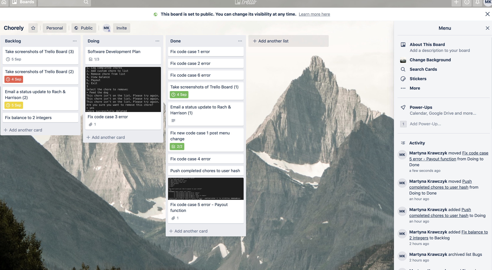

# User Instructions
## Repository
To access the repository, follow this link: [https://github.com/Martyna-krawczyk/chore-log-for-parents]

### To run the app, follow the steps below:

1. Make sure that you've installed ruby on your machine. I used 'rbenv'. This required homebrew.

2. Clone the repo using SSH.
````txt
git clone git@github.com:Martyna-krawczyk/chore-log-for-parents.git
````
3. 'cd' into the directory you've cloned.

4. Run the build.sh File
 To run the app, run the build.sh file to install the required gems and copy the appropriate ruby files.

5. Run the following command:
```txt
ruby run.rb
```

6. If you want to run in advanced mode - with a custom welcome message, enter the following command, typing your name into the 'name' field:
````txt
ruby run.rb name
````

## Testing

### Automated Testing
Test 1 - Testing that a new array element is added when the user adds a new chore to the list
````
chores = [chore1, chore2, chore3]
# Testing Add_New_Chores Method
def check_add_new_chores(chores)
    initial_number_of_chores = chores.length
    new_chore_list = add_new_chore(chores)
    if new_chore_list.length - initial_number_of_chores >=1
        return "Test passes!".colorize(:green)
    else
        return "Test fails 😭".colorize(:red)
    end
end
````

Test 2 - Testing that a new array element is added when the user adds a new chore to the list


### Manual Testing
The features were also tested manually.  Please use this link to view the sheet: [https://docs.google.com/spreadsheets/d/1jEf-tjmjS5an5clzq7E2ezlxGdY-ZSk4zjMZyYUQciQ/edit?usp=sharing]


# Project Management Tools Utilised
Trello Access
Please use this link to access the project board [https://trello.com/b/JKBDnXmb/chorely] 

## Screenshots





## Control Flow