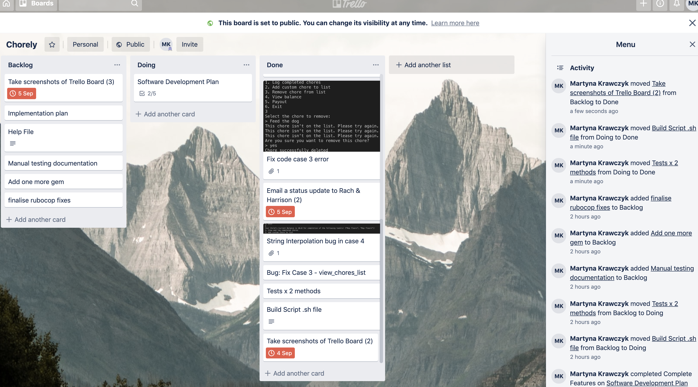

# CHORELY
## Contents

* Statement of Purpose
* Running the App
* Testing
* Project Management Tools
* Control Flow Diagram
* Accessing the Software Development Plan

## Statement of Purpose
The purpose of this app is to assist parents by tracking completed chores, logging new completed chores and accruing the respective dollar value of the chores so that parents can dispense pocket money to their child in one lump sum. 
As a parent myself, I would like to be able to track the extra chores the kids do so that I can pay them for their efforts in one lump sum. I feel that the financial insentive to do extra household chores would increase children's interest in helping their parents as well as help them to understand how small amounts of money can add up quickly, turning into a decent sum of money. As the app will have the ability to accrue the total dollar amount earned, this would help with decision making about whether the child should be dispensed cash, or receive money into their bank accounts, thus opening up a dialogue between parents and their children about finance, saving and responsible spending. In a society that is using cash a lot less, I believe this app will also encourage parents to deposit accrued pocket money into their child's bank account instead of dropping a couple of coins into a money box (without the ability to track savings or spendings).
The tarket audience for this app are parents of any age, with a child under 15 years old. The parent(user) will be able to select a chore from a pre-set library and mark it as complete, as well as enter a custom chore with its dollar value as chosen by the user.  The user will be able to view a balance of pocket money earned for the completed tasks, as well as the list of completed tasks.

## Features
1. View and log completed chores
2. Add custom chore to list
3. Remove chore from list
4. View balance and completed chores
5. Payout your clild
6. Exit

## Repository
To access the repository, follow this link: [https://github.com/Martyna-krawczyk/chore-log-for-parents]

### To run the app, follow the steps below:

1. Make sure that you've installed ruby on your machine. I used 'rbenv'. This required homebrew.

2. Clone the repo using SSH.
````txt
git clone git@github.com:Martyna-krawczyk/chore-log-for-parents.git
````
3. 'cd' into the directory you've cloned.

4. Run the build.sh File
 To run the app, run the build.sh file to install the required gems and copy the appropriate ruby files.

5. Run the following command:
```txt
ruby run.rb
```

6. If you want to run in advanced mode - with a custom welcome message, enter the following command, typing your name into the 'name' field:
````txt
ruby run.rb name
````

## Testing

### Automated Testing
Test 1 - Testing that a new array element is added when the user adds a new chore to the list
````
chores = [chore1, chore2, chore3]
# Testing Add_New_Chores Method
def check_add_new_chores(chores)
    initial_number_of_chores = chores.length
    new_chore_list = add_new_chore(chores)
    if new_chore_list.length - initial_number_of_chores >=1
        return "Test passes!".colorize(:green)
    else
        return "Test fails 😭".colorize(:red)
    end
end
````

Test 2 - Testing that a new array element is added when the user adds a new chore to the list
````
def check_remove_chores(chores)
  initial_number_of_chores = chores.length
    new_removed_chore_list = remove_chore(chores)
    if new_removed_chore_list.length + initial_number_of_chores >=1
        return "Test passes!".colorize(:green)
    else
        return "Test fails 😭".colorize(:red)
    end
end
````

### Manual Testing
The features were also tested manually.  Please use this link to view the sheet: [https://docs.google.com/spreadsheets/d/1jEf-tjmjS5an5clzq7E2ezlxGdY-ZSk4zjMZyYUQciQ/edit?usp=sharing]


# Project Management Tools Utilised
Trello Access
Please use this link to access the project board [https://trello.com/b/JKBDnXmb/chorely] 

## Screenshots




## Control Flow Diagram
The below comtrol flow diagram demonstrates the process the user will go through to log a chore as completed:


## Software Development Plan
See documents outside of README.